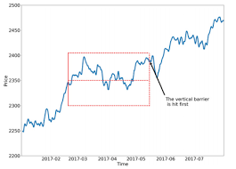

# Projects for Quant

Some code sinppet for quant trading with a foucs on machine learning applications. This project is referred to the following resources:

1. The book: [advances in financial machine learning](https://www.amazon.com/Advances-Financial-Machine-Learning-Marcos/dp/1119482089)

2. Git repo: [mlfinlab](https://github.com/hudson-and-thames/mlfinlab) project

**Basic dataformat**: the input data format is a pandas dataframe with the datetime index. And it should be ordered by the time. At the same time, it has ohlcv format.

**Demo Notebooks**: The folder ```TestingNotebooks``` have all the ipython notebooks that contain the testing logics:

    * utils functions
    * info-driven bar
    * Probabilistic of backtesting overfitting
    * Testing Sharpe

## Part 1 CustomBar Projects

Sample financial data to create alternative bar data. Conventional bars sampled by time interval may have the following drawbacks:

1. oversample information during low-activity periods and undersample information during high-activity periods
2. exhibit poor statistical properties such as serial correlation, non-normality of returns.

Therefore, some information-driven bars are proposed. The intuitive idea is that we are going to look at other information such as volume, price instead of the time axis.

## Part 2 Probability of Backtest Overfitting

How to quantify the probabilitiy of a group of trading strategies that may be overfitted. This project is modified from the [repo](https://github.com/esvhd/pypbo)

## Part 3 Triple-bar Labeling

The idea behind the triple-bar labeling lies that it consider the path of the price change, while the traditional treshold-cut method ignore it. There are three key lines: One the is the upper bond which is regarded as protfit taking line, another is the bottom bond which is regarded as stop loss line, the rest is the vertical one as the maximum holding period.



1. Label method:
    - touch the upper line    firstly, assign 1
    - touch the bottom line   firstly, assign -1
    - touch the vertical line firstly, assign 0
2. Meta Label method:

    This one is a meta-label method., which you can think it is a level-2 label. The first level algo may be aother trading rule. Then, the starting time is that each trade is initated.

    - If the trade is long,
        - Touch the upper line, assign 1
        - Else, assign 0
    - If the trade is short,
        - Touch the bottom line, assign 1
        - Else, assgin 0

    The advantages of meta-label method lie in that the automatic bet sizing capabilities. If you apply some ml algos with prob. output on the above binary classification problem(0 vs 1), the prob can be the sizing output.

## Part 4 Potfolio Optimization

This part is based on the [deep-portfolio-management](https://github.com/Rachnog/Deep-Portfolio-Management). It contains several approaches such as:

1. classic optimization
2. PCA portfolios
3. Autoencoder
4. Hierarchical Risk Parity
5. Foreacsting-based Portfolios
6. Reinforcement Learning Approaches

## Part 5 Technical  Features

This part is a high-level wrapper of the ta-lib. In addition, we are trying to combine several ta indicators into a new feature, which is normalized.

## Part 6 Utils Module

**Supported features**:

1. Utils
    - sample the bar data based on the time index
    - change the timezone of the time index
    - Compute daily vol. given input bar

2. fast_ewma

    using numba to speed up the ewma computation process

3. metrics

    contain lists of metrics that evaluates the trading performance
    - Adjusted Sharpe
    - Non-IID Sharpe
    - Deflated Sharpe Ratio

4. multiprocess

    parallel computation